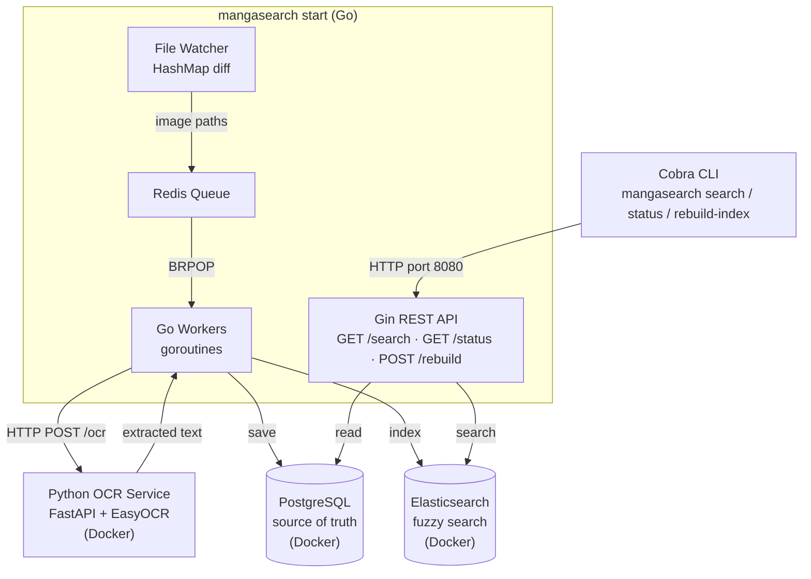

# MangaSearch

A local manga quote search engine built in Go and Python. Point it at your manga folder, it OCRs every page in the background, and lets you search across your entire collection — `"I sacrifice"` returns `Berserk Chapter 78, Page 13` in milliseconds.

No cloud. No subscriptions. Runs entirely on your machine.

---

## How It Works

Running `mangasearch start` boots a single Go process that owns the entire pipeline:

**File Watcher** walks your manga folder on startup and every 30 minutes. It builds a `map[path]modifiedTime`, diffs it against the last snapshot in PostgreSQL, and pushes only new or changed image paths into the Redis queue. Nothing gets re-processed unnecessarily.

**Go Workers** run inside the same process, each in its own goroutine. They pop image paths from Redis using `BRPOP`, parse the path to extract series/chapter/page, POST to the Python OCR service, get the extracted text back, and then save it themselves — writing to PostgreSQL and indexing into Elasticsearch.

**Python OCR Service** is a containerized FastAPI service backed by EasyOCR. It receives an image path, runs OCR, and returns the extracted text. That's all it does — storage is handled entirely by the Go workers.

**Gin REST API** runs inside the same Go process as the watcher and workers. It handles search queries by hitting Elasticsearch, exposes indexing status from PostgreSQL and Redis, and triggers rebuilds when asked.

**Cobra CLI** commands (`search`, `status`, `rebuild-index`) talk directly to the Gin API over HTTP. They don't boot anything — the server has to be running separately via `mangasearch start`.



---

## Requirements

- Go 1.21+
- Docker + Docker Compose

---

## Setup

**1. Clone the repo**

```bash
git clone https://github.com/Nr-009/mangasearch
cd mangasearch
go mod download
```

**2. Configure your environment**

Copy `.env.example` to `.env` and set your manga folder path:

```env
POSTGRES_USER=manga
POSTGRES_PASSWORD=manga
POSTGRES_DB=mangasearch
POSTGRES_PORT=5432

REDIS_PORT=6379
ES_PORT=9200
OCR_PORT=5001
API_PORT=8080

MANGA_FOLDER=/path/to/your/manga        # absolute path on your host machine
MANGA_FOLDER_CONTAINER=/manga           # where it's mounted inside Docker (leave as-is)

WORKERS=4                               # number of OCR workers (CPU cores - 1 recommended)
WATCHER_INTERVAL=30m                    # how often the file watcher rescans
```

**3. Build and run**

```bash
make start
```

That's it. `make start` builds the binary, brings up all Docker services (PostgreSQL, Redis, Elasticsearch, OCR), runs the initial scan, and starts the API server and file watcher. Leave this terminal running.

---

## Usage

MangaSearch needs **two terminals** — one to run the server, one to send commands.

**Terminal 1 — start the server (keep this running)**

```bash
make start
```

You will see the Docker services boot, the initial scan run, and the workers start processing pages. Leave this open.

**Terminal 2 — search and manage**

```bash
# Search for a quote across your entire collection
make search q="I sacrifice"

# Check how many pages are indexed and current queue length
make status

# Wipe PostgreSQL + Elasticsearch and rebuild everything from scratch
make rebuild
```

### Available Make commands

| Command | What it does |
|---|---|
| `make build` | Compile the binary |
| `make start` | Build + boot Docker + start server |
| `make search q="..."` | Search for a quote |
| `make status` | Show indexed page count and queue length |
| `make rebuild` | Wipe and reindex everything from scratch |
| `make clean` | Remove the compiled binary |

---

## Tech Stack

| Layer | Technology |
|---|---|
| Main app | Go |
| OCR service | Python, FastAPI, EasyOCR |
| Job queue | Redis |
| Source of truth | PostgreSQL |
| Search | Elasticsearch |
| CLI | Cobra |
| API | Gin |
| Infrastructure | Docker Compose |

---

## Project Structure

```
mangasearch/
  main.go                  ← entry point
  Makefile                 ← build, start, search, status, rebuild, clean
  cmd/                     ← Cobra CLI commands (start, index, search, status, rebuild)
  internal/
    api/                   ← Gin server, handlers, middleware
    config/                ← .env loading
    db/                    ← PostgreSQL connection and queries
    ocr/                   ← HTTP client for OCR service
    queue/                 ← Redis queue and workers
    search/                ← Elasticsearch indexing and search
    startup/               ← Docker health checks
    watcher/               ← filesystem walker and HashMap diff
  python/
    ocr_server.py          ← FastAPI OCR endpoint
    Dockerfile
```